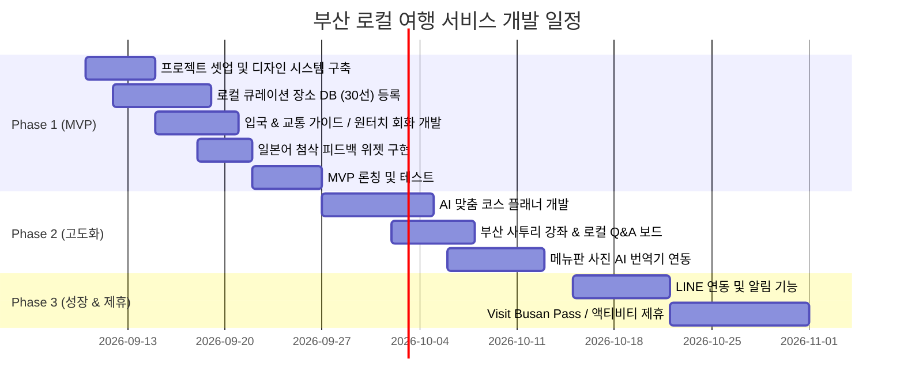

# [요구사항 정의서] 부산 로컬 여행 & 언어 교류 플랫폼 (trip-to-busan)

**문서 버전:** v1.0  
**작성일:** 2026-09-07  
**프로젝트 가칭:** 釜山びより (Busan Biyori / 부산비요리) - *일본어를 공부하는 부산 토박이의 리얼 부산 여행기*

---

## 1. 프로젝트 개요 (Overview)

### 1.1 프로젝트 배경
- **일본인 방한 트렌드**: 2026년 기준 방한 외국인 중 일본인 관광객 비중이 가장 높으며, 특히 부산은 일본 주요 도시(후쿠오카, 오사카, 도쿄)에서 비행기 및 선박으로 매우 쉽게 접근할 수 있는 인기 여행지임.
- **기존 공식 가이드의 한계**: 공공기관 및 대형 포털의 여행 정보는 방대하지만 다소 딱딱하고 광고성 콘텐츠가 많으며, 일본인 여행자가 실제로 현장에서 겪는 페인포인트(네이버 지도 사용 불편, 메뉴판 해독, 1인 식사 가능 여부, e-Arrival Card 등)를 섬세하게 해결해주지 못함.
- **새로운 서비스 콘셉트**: 부산에 거주하며 일본어를 공부하는 한국인 청년(운영자)이 자신의 관점에서 **진짜 로컬 정보**를 일본어로 큐레이션하고, 일본인 여행자는 이를 통해 여행 정보를 얻는 동시에 **자연스러운 일본어 교정(피드백) 및 질문으로 소통하는 '감성형 로컬 큐레이션 & 언어 교류 서비스'**를 구축함.

### 1.2 서비스 비전 및 목표
1. **신뢰 기반 로컬 큐레이션**: 부산 토박이가 직접 검증한 찐 로컬 맛집·스팟 정보를 일본인 감성에 맞춰 제공.
2. **여행 페인포인트 원스톱 해소**: 입국, 교통, 식당 주문, 길찾기 등 현장 불편을 최소화하는 실용 유틸리티 제공.
3. **참여형 언어·문화 교류**: "일본어 피드백 위젯", "부산 사투리 강좌", "로컬 Q&A"를 통해 운영자와 사용자 간의 따뜻한 라포(유대감) 형성.

---

## 2. 타겟 사용자 및 페르소나 (Target Personas)

### 2.1 주요 사용자 (일본인 여행자)
- **페르소나 A (20대 여성, 직장인 사토 씨)**: 
  - 2박 3일 주말 여행으로 부산 방문. K-뷰티, 감성 카페, 해운대/광안리 야경, 사진 촬영 중심.
  - 한국어는 기초 인사 정도만 구사. 식당에서 1인 식사가 가능한지, 너무 맵지 않은지 걱정함.
- **페르소나 B (30~40대 남녀, 재방문자 다나카 씨)**:
  - 2회차 이상 부산 방문. 관광객 전용 식당이 아닌 로컬 노포(돼지국밥, 자갈치 해산물)를 선호함.
  - 길찾기와 대중교통 이동 동선을 깔끔하게 확인하고 싶어 함.

### 2.2 서비스 운영자 (개발자/크리에이터)
- 부산에 거주하는 한국인. 일본 문화와 언어에 관심이 많아 일본어를 학습 중.
- 완벽하지 않더라도 정성스러운 일본어로 로컬 부산을 소개하고, 일본인 사용자들과 교류하며 자연스럽게 언어를 체득하고자 함.

---

## 3. 핵심 가치 및 차별화 요소 (Key Differentiators)

1. **진정성 (Authenticity)**: 광고/협찬 배제, 운영자의 '편애(偏愛) 로컬 스팟' 중심의 솔직 담백한 리뷰.
2. **응원 심리 자극 (Storytelling & Empathy)**: "일본어를 공부 중인 부산 토박이가 전하는 이야기"라는 콘셉트로 따뜻한 브랜드 이미지 구축.
3. **일본인 맞춤형 디테일 정보 (Japanese-tailored Details)**:
   - 일본어 카타카나 발음 및 한글 명칭 동시 병기 (택시나 현지인에게 바로 보여줄 수 있음).
   - `오히토리사마(おひとり様, 1인 식사) 환영 여부`, `맵기 지수(신라면 기준 비교)`, `카드 결제 여부`.
4. **가벼운 양방향 교류 (Interactive Feedback)**: 여행 정보 소비에 그치지 않고, 일본어 첨삭과 로컬 질문을 통한 커뮤니티성 확보.

---

## 4. 기능 요구사항 (Functional Requirements)

### 4.1 홈 및 브랜드 스토리 (Home & Story)
- **[FR-01] 운영자 프로필 & 환영 메시지**:
  - 운영자 소개(부산 거주, 일본어 공부 중, 부산을 사랑하는 이야기)를 친근한 일러스트/사진과 함께 일본어로 게재.
- **[FR-02] 테마별 큐레이션 하이라이트**:
  - "토박이의 소울푸드(국밥/밀면)", "바다와 카페", "레트로 골목 산책(남포/영도)", "야경 스팟" 등 테마별 카드 노출.
- **[FR-03] 오늘의 부산 현지 날씨 & 여행 팁**:
  - 부산 현지 기온 및 옷차림 팁 간단 제공.

### 4.2 로컬 큐레이션 가이드 (Local Places & Spots)
- **[FR-04] 장소 목록 및 필터링**:
  - 지역별(해운대, 광안리, 서면, 남포/자갈치, 영도, 기장 등), 카테고리별(식사, 디저트/카페, 볼거리/쇼핑, 체험) 필터링.
  - 특수 필터: `1인 식사 가능`, `맵지 않은 메뉴 있음`, `야경 명소`.
- **[FR-05] 장소 상세 페이지**:
  - 일본어 명칭, 카타카나 발음, 한글 명칭 병기 (예: `水辺最高テジクッパ (スビョン・チェゴ・テジクッパ / 수변최고돼지국밥)`).
  - 운영자의 찐 코멘트 (방문 팁, 주문 추천 조합, 피크타임 피하는 법).
  - 필수 체크 정보: 영업시간, 휴무일, 브레이크타임, 맵기 단계, 1인 가능 여부, 결제 수단.
  - 지도 링크 연동: 네이버 지도 웹 딥링크, 카카오맵, 구글 맵 링크 제공.

### 4.3 초개인화 AI 코스 플래너 (AI Course Planner)
- **[FR-06] 일정 맞춤 코스 생성**:
  - 입력값: 체류 기간(1박 2일, 2박 3일 등), 여행 스타일(미식 탐방, 감성 사진, 힐링/온천, 쇼핑), 이동 수단(지하철/버스, 택시).
  - 결과: 동선 낭비가 없는 일자별/시간대별 추천 루트(타임라인 UI)를 일본어로 자동 생성.
  - 코스 저장 및 URL 공유 기능 제공.

### 4.4 실전 여행 서포트 툴 (Travel Support Utility)
- **[FR-07] 입국 & 교통 필수 가이드 (입국 완벽 정복)**:
  - 2026년 최신 전자입국신고서(e-Arrival Card) 작성법 안내 (단계별 스크린샷).
  - 공항/부산항에서 시내 진입 가이드, 교통카드(T-money, WOWPASS, 트래블로그) 사용법 비교.
  - 외국인 지원 택시 앱(k.ride) 이용 팁.
- **[FR-08] 원터치 식당 회화 도우미 (指差し会話)**:
  - 식당에서 바로 쓸 수 있는 핵심 표현을 일본어-한국어 탭 카드로 제공 (화면을 보여주거나 TTS 음성 재생).
  - 예: *"고기 추가해 주세요 (お肉を追加してください)"*, *"덜 맵게 해 주세요 (辛さ控えめにしてください)"*, *"1명인데 식사 되나요? (1人ですが大丈夫ですか？)"*
- **[FR-09] 메뉴판 사진 AI 번역기 (MVP 이후 연동)**:
  - 한국어 메뉴판 사진을 업로드하면 메뉴명 번역, 가격, 재료 설명 및 추천 메뉴를 안내.

### 4.5 언어 교류 및 커뮤니티 (Interaction & Language Exchange)
- **[FR-10] 일본어 첨삭 피드백 위젯 (日本語フィードバック)**:
  - 각 글 하단에 가벼운 피드백 버튼 제공:
    - *"이 일본어가 자연스러웠나요?"* -> [👍 자연스러워요] / [✍️ 더 좋은 표현 알려주기]
    - 원클릭 폼으로 일본인 독자가 자연스러운 일본어 표현이나 오탈자를 제보할 수 있는 기능.
- **[FR-11] 부산 사투리 미니 강좌 (釜山方言プチレッスン)**:
  - 부산 현지에서 실제로 듣게 되는 사투리 해설 콘텐츠 (예: `단디 해라`, `밥 뭇나`, `와 이카노`).
- **[FR-12] 로컬 Q&A 우체통 (ローカル質問箱)**:
  - 여행자가 부산 여행 관련 질문(날씨, 추천, 이동 방법 등)을 남기면 운영자가 답변해 주는 미니 Q&A 공간.

---

## 5. 비기능 요구사항 (Non-Functional Requirements)

### 5.1 UI / UX 디자인
- **모바일 퍼스트(Mobile-First)**: 현지에서 스마트폰으로 이동 중에 가장 많이 조회하므로 완벽한 모바일 반응형 웹으로 구현.
- **디자인 톤앤매너**:
  - 일본 사용자에게 익숙한 깔끔함, 높은 텍스트 가독성, 따뜻한 파스텔 톤 및 로컬 감성 일러스트 배합.
  - 과도한 팝업이나 불필요한 배너 광고를 배제하고 직관적인 카드형 UI 적용.
- **다국어 표기**: 기본 UI 텍스트는 일본어(자연스러운 일본어), 장소명/메뉴명은 한글과 카타카나 동시 표기.

### 5.2 성능 및 SEO
- **속도 최적화**: 모바일 해외 로밍 환경을 고려하여 초기 로딩(LCP) 2초 이내 달성 (이미지 WebP 최적화, 정적 페이지 생성 활용).
- **글로벌 SEO**: Yahoo Japan 및 Google Japan 검색 결과 노출을 위해 일본어 메타태그, Open Graph, Sitemap, 구조화된 데이터(JSON-LD) 완비.

### 5.3 보안 및 데이터 관리
- 사용자 개인정보 수집 최소화 (로그인 없이도 대부분의 정보 열람 가능).
- 외부 API 키(Gemini, Maps 등)는 서버 환경변수로 철저히 은닉.

---

## 6. 시스템 아키텍처 및 권장 기술 스택

| 영역 | 기술 스택 | 선정 사유 |
| :--- | :--- | :--- |
| **Frontend** | **Next.js (App Router, TypeScript)** | 뛰어난 SSR/SSG 성능, SEO 최적화, 최신 React 생태계 |
| **Styling** | **Tailwind CSS + Lucide Icons** | 모바일 퍼스트 반응형 레이아웃 구현 및 가볍고 세련된 아이콘 |
| **Backend/DB** | **Supabase (PostgreSQL)** | 간편한 REST/GraphQL API, 장소 데이터베이스 및 Q&A/피드백 저장 |
| **AI Engine** | **Google Gemini API** | AI 맞춤 코스 추천 및 메뉴판 사진 OCR/번역 |
| **지도 연동** | **네이버 클라우드 Maps API / 딥링크** | 한국 내 정확한 위치 기반 링크 및 다국어 지원 |
| **배포/호스팅** | **Vercel** | 글로벌 엣지 네트워크 배포로 일본 현지 접속 속도 극대화 |

---

## 7. 단계별 개발 및 출시 로드맵 (Roadmap)

### 마일스톤 상세:
- **Phase 1 (MVP - 약 2~3주)**:
  - 브랜드 아이덴티티 및 모바일 웹 셸 구축
  - 로컬 맛집/스팟 30선 (상세 카드, 1인 식사/맵기 지표, 지도 링크)
  - 입국/교통 가이드 & 식당 손가락 회화(指差し)
  - 일본어 첨삭 피드백 위젯 (양방향 소통 시작)
- **Phase 2 (인터랙션 & AI 고도화)**:
  - Gemini API 기반 일정 맞춤 코스 생성기
  - 부산 사투리 미니 강좌 및 로컬 Q&A 엽서함
  - 메뉴판 사진 AI 번역
- **Phase 3 (확장 & 파트너십)**:
  - LINE 친구 추가 / 알림 연동
  - Visit Busan Pass 공식/어필리에이트 제휴 및 로컬 샵 할인 쿠폰 연계
