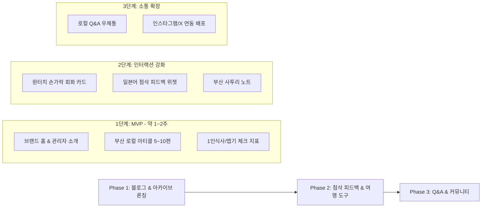

# [요구사항 정의서] 부산 토박이의 일본어 학습 & 로컬 아카이빙 플랫폼 (釜山だより)

**문서 버전:** v2.0 (콘셉트 재정렬 완료)  
**작성일:** 2026-09-07  
**서비스 공식명:** 釜山だより (Busan Dayori / 부산 다요리)  
**서비스 슬로건:** 日本語を勉強中の釜山っ子が届ける、ローカルな旅のお便り  
*(일본어를 공부 중인 부산 토박이가 전하는 로컬 여행 편지)*

---

## 1. 프로젝트 개요 (Overview)

### 1.1 기획 배경 및 철학
- **핵심 목적 (Core Goal)**: 부산에 살고 있는 한국인(관리자)이 일본과 일본 문화에 깊은 관심을 가지고, **자신의 일본어 실력을 향상시키기 위해 직접 일본어로 글을 쓰고 운영하는 학습 중심 서비스**입니다.
- **곁들이는 콘텐츠 (Secondary Value)**: 딱딱한 교재 문장이 아닌, 관리자가 매일 살아가는 **진짜 부산의 맛집, 카페, 숨은 명소, 일상 이야기**를 일본어로 작문하여 아카이빙합니다.
- **상호 작용 (Win-Win Exchange)**:
  - **관리자**: 부산 콘텐츠를 일본어로 작성하며 실전 작문 실력을 키우고, 일본인 원어민 독자로부터 자연스러운 일본어 피드백(첨삭)을 받습니다.
  - **일본인 독자**: 광고나 협찬이 없는 부산 현지인의 생생한 로컬 정보와 유용한 여행 팁을 얻고, 한국인 친구와 따뜻한 언어·문화 교류를 나눕니다.

### 1.2 서비스 성격
- 기업형 포털이나 복잡한 예약 대행 사이트가 아닌, **개인의 진정성과 온기가 살아 있는 '감성형 로컬 블로그 & 언어 교류 웹 서비스'**를 지향합니다.

---

## 2. 타겟 사용자 및 페르소나 (Personas)

### 2.1 서비스 관리자 (제작자 본인)
- 부산에 거주하는 20~30대 한국인.
- 일본어(JLPT, 회화, 작문)를 열심히 공부 중이며, 실제 일본인과의 소통을 통해 자연스러운 뉘앙스를 배우고 싶어 함.
- 부산의 숨은 골목, 찐 로컬 맛집, 계절별 명소를 잘 알고 있어 이를 일본어로 공유하고 싶음.

### 2.2 일본인 독자 (방문자)
- **속성**: 부산 여행을 계획 중이거나 한국(부산) 문화를 좋아하는 20~40대 일본인.
- **니즈**:
  - 흔한 관광청 홍보물이나 가이드북 대신, 현지인이 진짜 자주 가는 로컬 정보를 찾고 싶음.
  - 한국어를 잘 모르지만 현지에서 1인 식사가 가능한지, 맵기는 어느 정도인지 알고 싶음.
  - 열심히 일본어를 배우려는 부산 현지인을 따뜻하게 응원하고 피드백해주고 싶음.

---

## 3. 핵심 기능 요구사항 (Functional Requirements)

```
[ 홈 (피드/소개) ]
  ├── [1] 관리자 소개 & 학습 일기
  ├── [2] 부산 로컬 편지 (맛집/명소 아티클) ── [첨삭/피드백 위젯]
  ├── [3] 실전 손가락 회화 & 사투리 노트
  └── [4] 로컬 Q&A 우체통 (교류 공간)
```

### 3.1 홈 및 브랜드 스토리 (Home & Story)
- **[FR-01] 관리자 프로필 & 사이트 취지 안내**:
  - 관리자가 일본어를 공부하기 위해 만든 사이트임을 솔직하고 친근하게 소개.
  - *"일본어를 공부 중인 부산 사람입니다. 서툰 일본어가 있더라도 예쁘게 봐주시고 편하게 알려주세요!"* 메시지 강조.
- **[FR-02] 최신 편지(아티클) 피드**:
  - 최신 작성된 부산 맛집, 카페, 산책로 글을 카드 형태로 노출.
- **[FR-03] 오늘의 일본어 한마디 / 학습 메모**:
  - 관리자가 글을 쓰면서 새로 배운 단어나 표현 1개를 메인 상단에 위트 있게 소개.

### 3.2 부산 로컬 아카이빙 (Gourmet & Spot Letter)
- **[FR-04] 로컬 아티클(편지) 열람**:
  - 관리자가 직접 일본어로 작성한 부산 명소/맛집 포스팅.
  - 한국어 명칭과 카타카나 발음 동시 표기 (예: `水辺最高テジクッパ / スビョン・チェゴ・テジクッパ`).
  - 관리자 시선의 솔직 담백한 리뷰, 추천 메뉴 및 방문 팁.
- **[FR-05] 여행자 맞춤 실전 체크 정보**:
  - 포스팅 하단에 필수 실용 정보 아이콘 배지 제공:
    - `おひとり様 (1인 식사 환영 여부)`: 가능 / 불가 / 혼잡시간 제외 가능
    - `辛さレベル (맵기 지표)`: 안 매움 / 신라면 수준 / 매움 주의
    - `決済 (결제 수단)`: 신용카드 가능 여부, 현금 권장 여부
    - `位置 (지도)`: 네이버 지도 웹 링크 및 구글 맵 링크 제공
- **[FR-06] 카테고리 필터**:
  - `グルメ (맛집)`, `カフェ (카페)`, `散歩・夜景 (산책/야경)`, `日常 (부산 일상)` 등으로 간편 분류.

### 3.3 핵심 인터랙션: 일본어 첨삭 & 피드백 (添削・フィードバック)
- **[FR-07] 문장별 / 아티클별 첨삭 위젯**:
  - 글 하단(또는 문장 옆)에 귀여운 피드백 버튼 배치:
    - *"이 글의 일본어는 자연스러웠나요?"*
    - [👍 自然です (자연스러워요!)] / [✍️ 添削する (더 자연스러운 표현 알려주기)]
  - 일본인 독자가 로그인 없이도 가볍게 올바른 표현이나 뉘앙스를 제보할 수 있는 미니 폼.
- **[FR-08] 피드백 반영 & 감사 표시**:
  - 독자가 남겨준 피드백을 관리자가 확인하고 글에 반영할 수 있음.
  - 수정된 문장에는 *"독자 OOO님의 피드백으로 더 자연스러워졌습니다!"* 감사 코멘트 표기 가능.

### 3.4 여행자 도우미 & 학습 노트 (Traveler Support & Notes)
- **[FR-09] 원터치 손가락 회화 (指差し会話)**:
  - 관리자가 일본어를 공부하며 역으로 정리한 **"일본인 여행자가 식당/카페에서 화면만 보여주면 되는 한국어 문장집"**.
  - 탭하면 크게 확대되거나 음성(TTS)을 들려줄 수 있는 카드 UI.
  - 예: *"고기 추가해 주세요"*, *"덜 맵게 해 주세요"*, *"1명 식사 가능한가요?"*
- **[FR-10] 부산 사투리 미니 노트 (釜山方言ノート)**:
  - 식당 이모님이나 시장에서 자주 들리는 부산 사투리를 일본어로 재미있게 해설 (예: `단디 해라`, `밥 뭇나`, `와 이카노`).

### 3.5 로컬 Q&A 우체통 (ローカル質問箱)
- **[FR-11] 여행자 질문 남기기**:
  - 일본인 독자가 부산 여행에 대해 궁금한 점(예: *"비 오는 날 가기 좋은 곳이 있나요?"*)을 남기면 관리자가 확인.
- **[FR-12] 관리자 일본어 답변**:
  - 관리자가 일본어로 정성스레 답변을 작성하여 게시판에 공개, 자연스러운 언어 연습 및 정보 축적.

### 3.6 관리자 기능 (Admin Features)
- **[FR-13] 아티클 작성 및 마크다운 에디터**:
  - 관리자가 편리하게 일본어 텍스트, 사진, 지도 링크, 실전 체크 지표(맵기, 1인 여부)를 입력하여 포스팅.
- **[FR-14] 독자 피드백 & 질문 관리**:
  - 독자들이 남긴 첨삭 코멘트와 질문을 모아보고 승인/답변/수정 처리.

---

## 4. 비기능 요구사항 (Non-Functional Requirements)

1. **디자인 톤앤매너**:
   - 아날로그 감성의 정갈한 편지/수첩 느낌 (따뜻한 크림/화이트 베이스, 감성적인 폰트, 미니멀한 카드 레이아웃).
   - 과도한 광고나 배너 없이 콘텐츠와 텍스트의 가독성을 최우선으로 배치.
2. **모바일 퍼스트 (Mobile-First)**:
   - 여행자가 이동 중 스마트폰으로 편하게 읽고 손가락 회화를 보여줄 수 있도록 반응형 UI 설계.
3. **가벼움과 빠른 속도**:
   - 복잡한 대형 시스템 대신, 1인 운영에 최적화된 가볍고 유지보수가 쉬운 모던 웹 아키텍처.
4. **글로벌 SEO**:
   - 일본 포털(Google Japan, Yahoo Japan)에서 "釜山 ローカル グルメ (부산 로컬 맛집)", "釜山 一人旅 (부산 혼자 여행)" 등으로 자연 검색 유입이 되도록 메타태그 및 OG 태그 최적화.

---

## 5. 시스템 아키텍처 및 기술 스택

| 구분 | 선정 기술 | 선정 이유 |
| :--- | :--- | :--- |
| **Frontend** | **Next.js (App Router, TypeScript)** | 뛰어난 SEO, 모바일 반응형 구현, 컴포넌트 재사용성 |
| **Styling** | **Tailwind CSS** | 아기자기하고 깔끔한 커스텀 디자인을 빠르게 구현 |
| **Database & API** | **Supabase (PostgreSQL)** | 간편한 아티클 저장, 첨삭 피드백 및 Q&A 실시간 수집 |
| **배포 & 호스팅** | **Vercel** | 글로벌 CDN 무료 지원으로 일본 현지 접속 속도 우수 |

---

## 6. 단계별 개발 로드맵 (Roadmap)



### 요약:
이 서비스는 **"한국인의 일본어 공부"**라는 진정성 있는 개인의 성장 스토리 위에, **"부산 토박이의 찐 맛집/여행 정보"**를 얹어 일본인 독자들과 따뜻하게 연결되는 지속 가능한 1인 서비스 플랫폼입니다.
